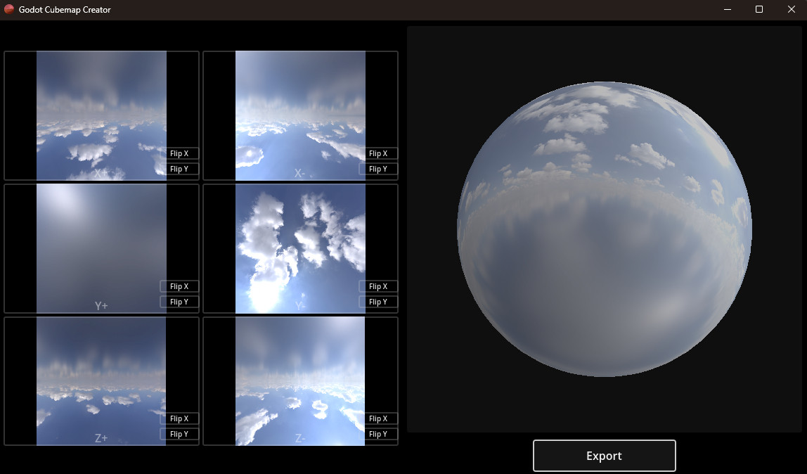

# Godot Cubemap Creator

Create and preview cubemap textures for Godot by selecting them individually.

Simply select the 6 cubemap images on the left, flip them around if necessary, then export with the export button.

## Download

To download and use the program, go to [the latest release](https://github.com/figglewatts/godot-cubemap-creator/releases/latest/), download the zip file, extract it somewhere, and run it.

Currently only Windows is supported. If you need support for Mac or Linux let me know and I can set up some CI/CD on this repo to do all of the platforms - at the moment I'm doing it manually.

## Details

Exports cubemap textures in this format:

